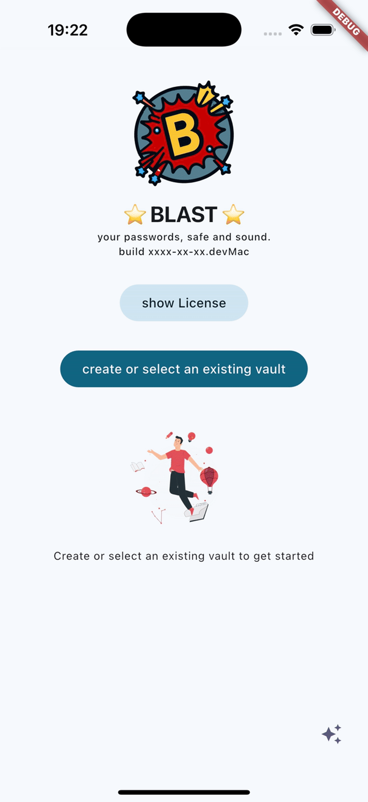

# Blast

Your passwords, safe and sound.


Blast is an open-source, cross-platform password and secrets manager built with Flutter.
Your data lives in a single encrypted vault file protected by a master password - no proprietary backend required.



## Highlights

- Bring your own storage: use your favorite cloud provider or your local file system
- Single portable vault file: easy to back up, move, and keep under your control
- One codebase, many platforms: Android, iOS, Windows, macOS, Linux, and Web

## Download / Use

- Web: https://blast.duckiesfarm.com
- iOS: https://apps.apple.com/it/app/blast-open-source-password-mgr/id6742346050
- Windows: https://apps.microsoft.com/detail/9nz7l5snvsxx
- Android: currently in private beta (send a DM: https://github.com/nicolgit/)
- macOS: TestFlight access (send a DM: https://github.com/nicolgit/)
- Linux: not distributed yet (build from source)

## Features

- Advanced search and sorting
- Favorites and tags
- Flexible card fields (attributes/rows)
- Markdown notes
- Light and dark theme
- Built-in password generator
- Display values as text, barcode, or QR code
- Import from other password managers:
  - KeePass XML (2.x)
  - Password Safe XML

### Platform feature map

Some features are still rolling out across platforms.

| Feature                    | Android | iOS     | Linux   | macOS | Web     | Windows |
| -------------------------- | ------- | ------- | ------- | ----- | ------- | ------- |
| Export Blast-readable JSON | planned | planned | planned | yes   | planned | planned |
| Import Blast-readable JSON | planned | planned | yes     | yes   |         | yes     |

Legend: yes = supported, planned = planned

## Storage backends

Blast aims to support the most common storage providers. Not all providers are implemented and tested on all platforms yet.

| Storage               | Android | iOS | Linux | macOS | Web | Windows |
| --------------------- | ------- | --- | ----- | ----- | --- | ------- |
| Local file system     | yes     | yes | yes   | yes   |     | yes     |
| OneDrive              | yes     | yes | yes   | yes   | yes | yes     |
| OneDrive (app folder) | yes     | yes | yes   | yes   | yes | yes     |
| Dropbox               | yes     | yes | yes   | yes   | yes | yes     |
| Dropbox (app folder)  |         |     |       |       |     |         |
| Azure Storage         |         |     |       |       |     |         |
| AWS S3                |         |     |       |       |     |         |
| Google Drive          |         |     |       |       |     |         |
| iCloud                |         |     |       |       |     |         |
| Lorem Cloud (*)       | yes     | yes | yes   | yes   | yes | yes     |

(*) Fake cloud used for testing only.

## File format and cryptography

The vault is stored as a `.blast` file: a small binary header plus an encrypted JSON body.

- Encryption: AES-256-CBC with PKCS7 padding
- Key derivation: PBKDF2 (salt + iteration count stored in the header)

Full spec: [docs/file-format.md](docs/file-format.md)

## Build from source

### Repository layout

- App: `code/app/blastapp`
- Core model / crypto / cloud providers: `code/app/blastmodel`

### Prerequisites

- Flutter SDK (Dart >= 3.1.3 and < 4.0.0)
- Platform toolchains (Xcode for iOS/macOS, Android Studio for Android, Visual Studio for Windows, etc.)

### Run

```bash
cd code/app/blastapp
flutter pub get
flutter run
```

### Web

```bash
cd code/app/blastapp
flutter run -d chrome
```

## Cloud provider setup (optional)

If you want to test cloud backends (OneDrive/Dropbox), you may need to register your own OAuth apps and set client IDs.

- Setup notes: [docs/clouds-setup.md](docs/clouds-setup.md)
- Secrets template: [code/app/blastmodel/lib/secretsToFill.dart](code/app/blastmodel/lib/secretsToFill.dart)

## Privacy

Blast does not run its own servers. Your encrypted vault is stored either locally or in the cloud provider you choose.

See [PRIVACYPOLICY.md](PRIVACYPOLICY.md).

## Contributing

Issues and pull requests are welcome.

## Security

If you believe you found a security vulnerability, please use GitHub's private vulnerability reporting.

## License

MIT - see [LICENSE](LICENSE).
