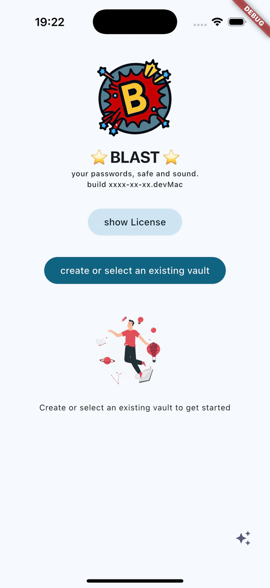

<p align="center">
  <a href="https://blast.duckiesfarm.com">
    
  </a>
</p>

# Blast

**Private. Portable. Simple.**

Blast is an open-source, cross-platform password and secrets manager designed for people who want **full control over their data**.

No proprietary backend. No forced cloud. No lock-in.


## 🧠 Why Blast?

Most password managers rely on their own infrastructure.

**Blast doesn’t.**

- Your vault is just a file
- You choose where it lives
- You can move it anytime

👉 Local? Cloud? USB drive? Your choice.


## 🔐 Core principles

- **Privacy-first** → no servers, no tracking, no data collection
- **Portability** → a single encrypted file you can move anywhere
- **Simplicity** → no complex setup, no vendor lock-in

## 📦 How it works

Blast stores everything inside a single encrypted `.blast` vault file.

- Copy it → backup
- Move it → change provider
- Keep it offline → maximum control

## ✨ Highlights

- Bring your own storage (local or any cloud provider)
- Single portable vault file
- Fully offline-compatible
- One codebase, all platforms:
  - Android, iOS, Windows, macOS, Linux (manual build), Web

---

## Blast in action



---

## 🚀 Get started

- Web: https://blast.duckiesfarm.com  
- iOS / macOS: https://apps.apple.com/it/app/blast-open-source-password-mgr/id6742346050  
- Android: https://play.google.com/store/apps/details?id=com.nicoladelfino.blastapp  
- Windows: https://apps.microsoft.com/detail/9nz7l5snvsxx  
- Linux: build from source  

## 🧩 Features

- Advanced search and sorting
- Favorites and tags
- Flexible custom fields
- Markdown notes
- Password generator
- QR / barcode support
- Light / dark mode

### Import support

- KeePass XML (2.x)
- Password Safe XML
- CSV

## ☁️ Storage: Bring Your Own

Blast does not manage your data.

You can store your vault wherever you want:

- Local file system
- OneDrive
- Dropbox
- (more providers coming)

👉 You can switch anytime — just move the file.

## 🔒 Security

Blast is designed with a simple principle:

> **Your data is always encrypted before leaving your device.**

### Cryptography

- Encryption: AES-256-CBC (PKCS7)
- Key derivation: PBKDF2 (with salt + iterations in header)

Vault structure:
- Binary header (parameters)
- Encrypted JSON body

Full specification:  
👉 `docs/file-format.md`


## ⚠️ Threat model (important)

Blast protects your data if:

- your device is secure
- your master password is strong

Blast does **not** protect against:

- compromised devices (malware, keyloggers)
- weak master passwords


## 🔍 Comparison

| Feature            | Blast | Typical cloud manager |
|------------------|------|----------------------|
| Own servers       | ❌   | ✅                   |
| Vendor lock-in    | ❌   | ✅                   |
| Portable vault    | ✅   | ❌                   |
| Offline usage     | ✅   | ⚠️ limited           |


## 🛠 Build from source

```bash
cd code/app/blastapp
flutter pub get
flutter run
```
## Cloud provider setup (optional)

If you want to test cloud backends (OneDrive/Dropbox), you may need to register your own OAuth apps and set client IDs.

- Setup notes: [docs/clouds-setup.md](docs/clouds-setup.md)
- Secrets template: [code/app/blastmodel/lib/secretsToFill.dart](code/app/blastmodel/lib/secretsToFill.dart)

## Privacy

Blast does not run its own servers. Your encrypted vault is stored either locally or in the cloud provider you choose.

See [PRIVACYPOLICY.md](PRIVACYPOLICY.md).

## License

MIT - see [LICENSE](LICENSE).
