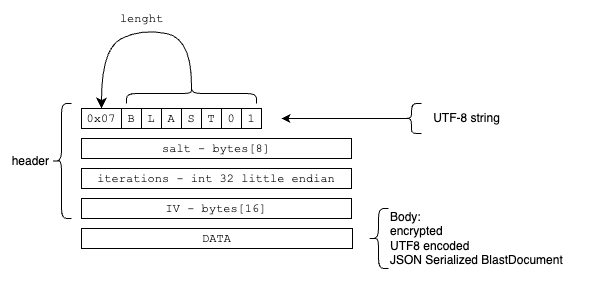

# .blast File Format Specification

## 1.0 Introduction

This document describes the .blast file format v1 used by Blast.

The file is composed by a header and a body. 

## 2.0 Header

The header is composed of four fields:

### 2.1 File Version

The file version is a string that begins with a byte indicating the length of the string. The string itself follows the byte. Current file version is `0x07 B L A S T 0 1`.

### 2.2 Salt

The salt is an 8-byte array. This is used in the generation of the key for decryption of the body.

### 2.3 Iteration

The iteration is a 32-bit little endian integer. This is also used in the generation of the key for decryption of the body.

### 2.4 IV Vector

The IV (Initialization Vector) is a 16-byte array. This is used in the decryption of the body.

## 3.0 Body

The body is a UTF8 encoded, JSON serialized document. It is encrypted using 256-bit AES algorithm with CBC (Cipher Block Chaining) as the block cipher mode and PKCS7 padding.

## 4.0 Decoding the Body

To decode the body, follow these steps:

### 4.1 Key Generation

Use the salt and iteration to generate the key using the PBKDF2 (Password-Based Key Derivation Function 2) algorithm.

### 4.2 Decryption

Use the IV and the key to decode the body using the 256-bit AES algorithm. The resulting output will be the original UTF8 encoded, JSON serialized document.

## 5.0 JSON file structure

The file is composed of three main elements: \"Id\", \"Version\", and \"Cards\". 

### 5.1. Id

The \"Id\" is a unique identifier for the file. It is represented as a string value in UUID format.

### 2.2. Version

The \"Version\" is an integer that represents the version of the file, must be 1.

### 2.3. Cards

The \"Cards\" is an array of objects, each representing a unique \"Card\". Each \"Card\" has the following attributes:

- \"Id\": A unique identifier for the card, represented as a string in UUID format.

- \"IsFavorite\": A boolean indicating whether the card is marked as a favorite.

- \"LastOpenedDateTime\": A string representing the date and time the card was last opened in ISO 8601 format.

- \"LastUpdateDateTime\": A string representing the date and time the card was last updated in ISO 8601 format.

- \"Notes\": A string containing additional information or notes about the card.

- \"Rows\": An array of objects each containing three attributes:
  - \"Name\": A string representing the name of the row.
  - \"Value\": A string value associated with the row.
  - \"Type\": An integer indicating the type of the row. Allowed values:
    - 1 - string
    - 2 - password
    - 3 - URL
    - 4 - header

- \"Tags\": An array of strings, each representing a tag associated with the card.

- \"Title\": A string representing the title of the card.

- \"UsedCounter\": An integer representing the number of times the card has been used.

## 6.0 References

1. AES algorithm: <https://en.wikipedia.org/wiki/Advanced_Encryption_Standard>
2. CBC block cipher mode: <https://en.wikipedia.org/wiki/Block_cipher_mode_of_operation>
3. PKCS7 padding: https://en.wikipedia.org/wiki/Padding_(cryptography)
4. encode/decode [source file](../code/app/blastmodel/lib/currentfile_service.dart) in blast
5. sample [decode .json document](../import-file-samples/blastapp-export.json)